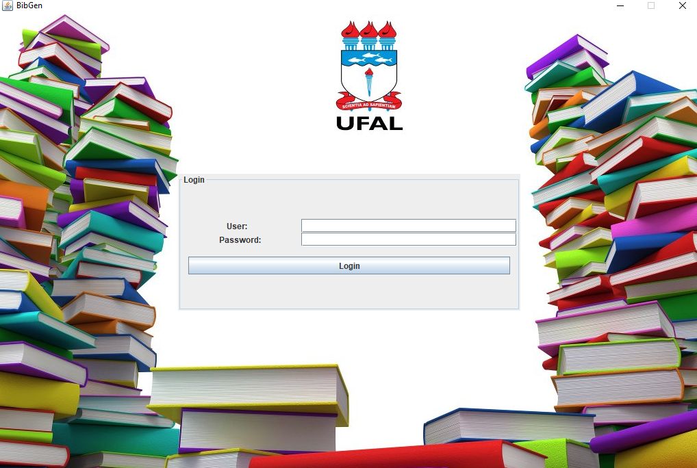

# BibGen

</br>

## Description
   BibGen is the acronym of Gerenciador de Biblioteca (Library Management, in english).
   This desktop application must give the librarian operations over the library such as:
   
   * Add, update and remove users and books in the system
   * Search through the users and books entries.
   * Allow users to rent, renew, return and schedule books.
   * Print daily reports. 

   The goal of this project is to obtain grades in Software Development Process' class.
    
## Requirements
```xml
<!-- https://mvnrepository.com/artifact/org.hibernate/hibernate-entitymanager -->
<dependency>
    <groupId>org.hibernate</groupId>
    <artifactId>hibernate-entitymanager</artifactId>
    <version>5.0.1.Final</version>
</dependency>
```

```xml
<!-- https://mvnrepository.com/artifact/mysql/mysql-connector-java -->
<dependency>
    <groupId>mysql</groupId>
    <artifactId>mysql-connector-java</artifactId>
    <version>5.1.41</version>
</dependency>
```

```xml
<!-- https://mvnrepository.com/artifact/com.itextpdf/itextpdf -->
<dependency>
    <groupId>com.itextpdf</groupId>
    <artifactId>itextpdf</artifactId>
    <version>5.4.1</version>
</dependency>
```

And also Oxyde theme.

## Packages
* Entities

    
    * Book
    * User
    * Librarian
    * UsersBook
    * ScheduleBook
    
* GUI 
    
   
    * Main Window - JFrame and the main method
    * Panel Manager - The handler of the Login and Application JPanels
    * Librarian Panel - JPanel which handles all subpanels after the login
    * Many subpanels
    
* Util

    The utilities for entities and components such as: users, books, tables, columns and hibernate connection.
